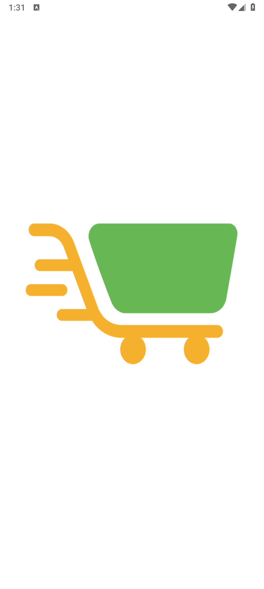
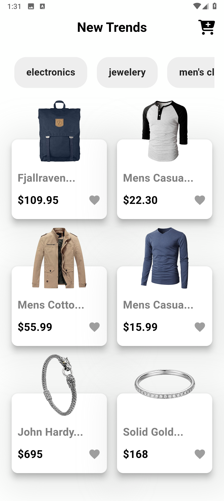
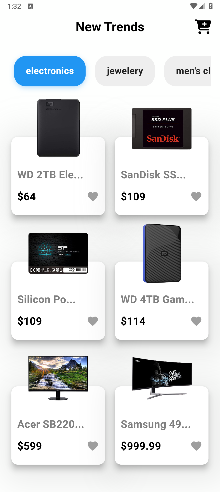
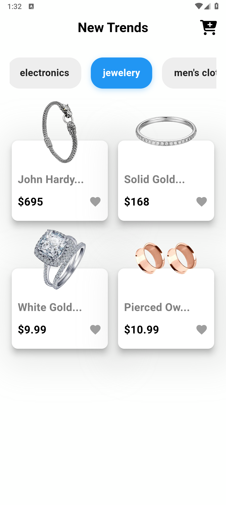
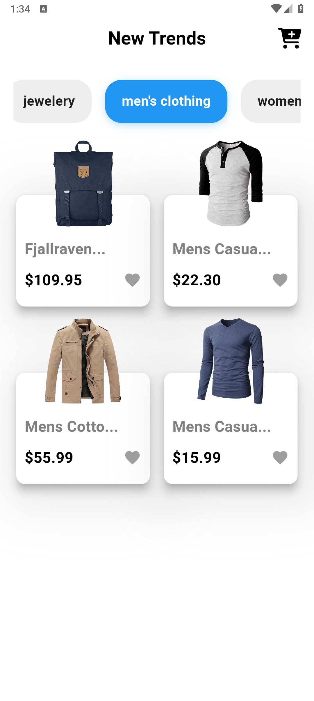
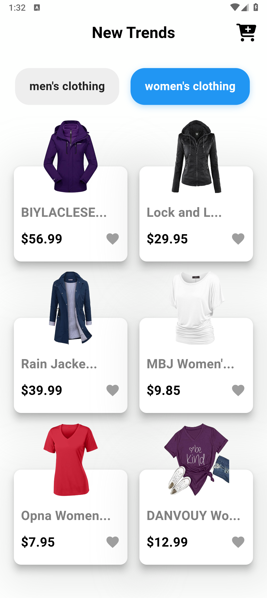
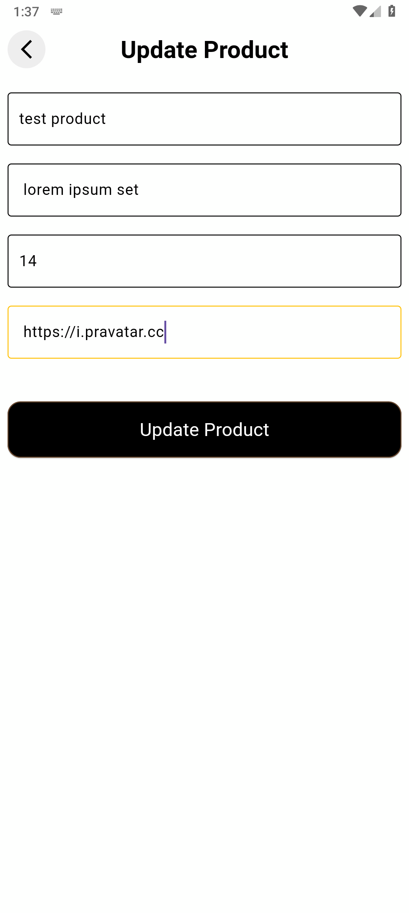
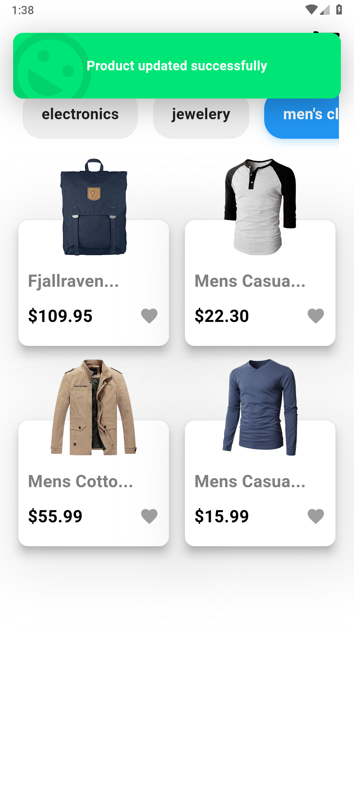

# Store App

Store App is a mobile application built with Flutter that showcases products from the Fake Store API. It serves as a practical example of building an e-commerce style application, demonstrating concepts like REST API integration, state management, and creating a dynamic user interface.

## Features

- **Browse Products**: View a grid of all available products fetched from the API.
- **Filter by Category**: Dynamically load and filter products based on selected categories.
- **Update Products**: Tap on a product to navigate to a screen where its details (name, price, description, image) can be updated.
- **Add to Favorites**: Mark and unmark products as favorites on the product card.
- **User Feedback**: Utilizes progress indicators during data loading and displays success/error snackbars for user actions.
- **Responsive UI**: Adapts to different screen sizes using `flutter_screenutil`.

## Screenshots
<p align="center">
  
  
  
  
  
  
  
  
</p>
## Project Architecture

The project follows a feature-driven architecture, separating code into distinct features like `home` and `splash`. Within each feature, a layered approach is used:

-   **Data Layer**: Contains models (`ProductModel`), services for API communication (`GetAllProducts`, `UpdateProducts`, etc.), and an API helper class to handle HTTP requests.
-   **Presentation Layer**: Includes UI views/screens (`HomeView`, `UpdateProductView`), reusable widgets, and state management using `flutter_bloc` (Cubit).
-   **Core**: Centralizes shared components, constants (colors, styles, routes), and custom widgets for reusability across the application.

## Key Libraries Used

-   **`flutter_bloc`**: For predictable and scalable state management.
-   **`http`**: For making requests to the [Fake Store REST API](https://fakestoreapi.com/).
-   **`cached_network_image`**: To efficiently load and cache product images from the network.
-   **`modal_progress_hud_nsn`**: To display a loading overlay during asynchronous operations like updating a product.
-   **`top_snackbar_flutter`**: For displaying non-intrusive success and error messages to the user.
-   **`flutter_screenutil`**: For creating a responsive UI that adapts to various screen sizes and densities.
-   **`font_awesome_flutter`**: For using the Font Awesome icon set.


## Getting Started

Follow these instructions to get a copy of the project up and running on your local machine for development and testing purposes.

### Prerequisites

Ensure you have the Flutter SDK installed on your machine. For installation guides, please refer to the [official Flutter documentation](https://flutter.dev/docs/get-started/install).

### Installation & Setup

1.  **Clone the repository:**
    ```sh
    git clone https://github.com/omargamaldev/store-app.git
    ```

2.  **Navigate to the project directory:**
    ```sh
    cd store-app
    ```

3.  **Install dependencies:**
    ```sh
    flutter pub get
    ```

### Running the Application

1.  Ensure you have a device connected or an emulator running.

2.  Run the app from your terminal:
    ```sh
    flutter run